# 🚀 SocialPilot – Social Media Scheduler & Campaign Management Platform

A centralized, enterprise-grade social media management platform designed to help individuals, businesses, content creators, and marketing teams efficiently manage, schedule, analyze, and automate their multi-platform social media presence.

---

## 🚀 Milestone 3 Status Dashboard

Below is the live status dashboard for the **Milestone 3** deliverables. It showcases completed items (green glowing LEDs) and full backend & database integrations.



<details open>
<summary><b>📊 Expand for Detailed Deliverables Breakdown</b></summary>
<br>

### 🗄️ Database Team (100% Completed)
- [x] **PostgreSQL & MongoDB Configured** (Containerized orchestration inside `docker-compose.yml`)
- [x] **Relational & NoSQL Schema Created** (User, SocialAccount, Campaign, Content, ScheduledPost, PublishingLog, Analytics models)
- [x] **SQLAlchemy ORM & Session Pooling** (Robust connection pooling and session management in `database/postgresql/connection.py`)
- [x] **Alembic Database Migrations** (Versioned migrations in `database/migrations/versions/`)
- [x] **Database Seeding & Reference Tables** (Role references and default campaign data populated)

### ⚙️ Backend Team (100% Completed)
- [x] **FastAPI Project Architecture** (Clean Architecture structure in `backend/app/main.py`)
- [x] **JWT Authentication & Security** (`/register`, `/login`, `/refresh`, token rotation, and bcrypt password hashing)
- [x] **Role-Based Access Control (RBAC)** (Role enforcement for Admin, Manager/Marketing Team, and Content Creator)
- [x] **Campaign & Post Scheduling APIs** (`/api/campaigns`, `/api/campaigns/{id}/schedule`, tracking metrics, and status filters in `app/presentation/routes/campaigns.py`)
- [x] **Real-Time Notification Broadcasting** (Server-Sent Events & background tasks for campaign/post creation alerts)
- [x] **Account & User Management APIs** (Profile updates, password changes, team governance in `app/presentation/routes/users.py`)
- [x] **Swagger & ReDoc Documentation** (Automatically served at `http://localhost:8000/docs`)

### 💻 Frontend Team (100% Completed)
- [x] **Vite + React + TypeScript Architecture** (Modern, fast frontend application)
- [x] **Authentication & Role-Based Layouts** (Seamless login/register flows with dynamic role-based sidebar & navigation)
- [x] **Campaign Management Dashboard** (Full campaign lifecycle control, quick status dropdown switcher, budget tracking, and status filtering)
- [x] **Live Multi-Platform Post Preview Sandbox** (Real-time preview across Instagram, Facebook, LinkedIn, X/Twitter, YouTube, Pinterest with character limit checks and best-time-to-post recommendations)
- [x] **Content Calendar & Post Scheduler** (Interactive timeline and post management)
- [x] **Team Management Page** (Member search with icon alignment, role assignment modal, deactivate/activate toggles, and permissions reference)
- [x] **Real-Time API & Database Integration** (Centralized `apiFetch` service connected to FastAPI backend)

</details>

---

## 🧭 Interactive Navigation
*   [📌 Project Overview](#-project-overview)
*   [✨ Comprehensive Feature Highlights](#-comprehensive-feature-highlights)
*   [🎯 Objectives & Deliverables](#-objectives--deliverables)
*   [🛠 Tech Stack](#-tech-stack)
*   [🏛 Architecture](#-architecture)
*   [📂 Project Structure Explorer](#-project-structure-explorer)
*   [📚 Core Modules](#-core-modules)
*   [⚙ Setup Instructions](#-setup-instructions)
*   [🌿 Git Branch Strategy](#-git-branch-strategy)
*   [👥 Team & License](#-team)

---

## 📌 Project Overview

SocialPilot empowers marketing teams, agency managers, and content creators to plan, schedule, publish, and analyze social media content from a single, intuitive control center. By integrating relational data models (PostgreSQL) and flexible analytics storage (MongoDB) with a high-performance FastAPI backend and React frontend, SocialPilot streamlines team collaboration and boosts audience engagement.

---

## ✨ Comprehensive Feature Highlights

### 1. 🔑 Role-Based Access Control (RBAC) & Governance
* **Hierarchical Roles**: 
  * 🛡️ **Administrator**: Full platform authority (billing, integrations, user role management, account deletion).
  * 📢 **Marketing Team / Manager**: Create and edit campaigns, schedule posts, approve content, analyze performance.
  * ✍️ **Content Creator**: Draft content, preview platform views, submit posts for approval, suggest post times.
* **Role Badges & Security Guards**: Enforced both on the backend API layer and frontend UI components.

### 2. 🚀 Campaign Management & Control Center
* **Lifecycle Tracking**: Organize posts under targeted marketing campaigns (`Active`, `Scheduled`, `Completed`, `Paused`, `Draft`).
* **Interactive Status Dropdown**: Change campaign statuses directly within the dashboard table with real-time backend persistence.
* **Filter & Search**: Instant filter by status (`All Statuses`, `Active`, `Scheduled`, `Completed`, `Draft`) and keyword search.
* **KPI & Budget Tracking**: Monitor budget allocation vs. spend and target conversions.

### 3. 👁️ Live Multi-Platform Post Preview & Post Editor
* **Platform Simulation**: Preview post captions, handles, and layout mockups across **Instagram, Facebook, LinkedIn, X (Twitter), YouTube, and Pinterest**.
* **Character Limit Guard**: Real-time character counter and max-length warnings tailored per network.
* **Best-Time-To-Post Intelligence**: Suggests optimal publishing hours per social platform based on target audience activity.

### 4. 📅 Content Calendar & Chronological Queue
* **Visual Post Scheduling**: View scheduled posts organized chronologically.
* **Multi-Platform Tags**: Color-coded badges indicating post platform, campaign link, and publication status.

### 5. 👥 Team Management Workspace
* **Teammate Directory**: Search team members by name or email with aligned search controls.
* **Role Assignment & Actions**: Change teammate roles dynamically, invite new members, deactivate or remove workspace accounts.
* **Role Permissions Reference**: Expandable guide detailing permission scopes per role.

### 6. 🔔 Real-Time Notification Center
* **Instant Alerts**: Server-Sent Events (SSE) and background broadcast tasks alert team members when new campaigns are launched or posts are scheduled.

---

## 🎯 Objectives & Deliverables

- [x] Multi-tenant social account management
- [x] Campaign creation, tracking, and interactive status management
- [x] Multi-platform post creator with live visual preview
- [x] Automated post scheduling and calendar view
- [x] Role-Based Access Control (Admin, Manager, Creator)
- [x] Team management and role governance
- [x] Real-time notification center for campaign alerts
- [x] PostgreSQL relational data modeling & Alembic migrations
- [x] MongoDB analytics storage & connection setup
- [x] FastAPI RESTful API architecture with OpenAPI/Swagger docs

---

## 🛠 Tech Stack

| Frontend | Backend | Database | DevOps & Tooling |
| :--- | :--- | :--- | :--- |
| • React 18 / Vite<br>• TypeScript<br>• Tailwind CSS (v4)<br>• React Router v6<br>• Lucide / Custom SVG Icons | • FastAPI<br>• Python 3.11+<br>• SQLAlchemy ORM<br>• Alembic Migrations<br>• Pydantic v2<br>• JWT Authentication | • PostgreSQL 15+<br>• MongoDB 6.0+ | • Docker & Docker Compose<br>• Git & GitHub<br>• Uvicorn ASGI Server |

---

## 🏛 Architecture

SocialPilot follows **Clean Architecture** principles within a modular framework, separating business rules from infrastructure details.

```
  ┌─────────────────────────────────────────────────────────┐
  │ Presentation Layer (FastAPI Routes, Auth Guards, SSE)   │
  │   ┌─────────────────────────────────────────────────┐   │
  │   │ Application Layer (Services, Use Cases, DTOs)   │   │
  │   │   ┌─────────────────────────────────────────┐   │   │
  │   │   │ Domain Layer (Entities, Model Enums)    │   │   │
  │   │   └─────────────────────────────────────────┘   │   │
  │   └─────────────────────────────────────────────────┘   │
  │ Infrastructure Layer (PostgreSQL, MongoDB, Alembic)     │
  └─────────────────────────────────────────────────────────┘
```

---

## 📂 Project Structure Explorer

```
SocialPilot/
├── docker-compose.yml               # Multi-container orchestration (PostgreSQL + MongoDB)
├── README.md                        # Documentation & Status Dashboard
├── docs/
│   ├── milestone1_status.svg        # Live animated status dashboard graphic
│   └── DATABASE_ARCHITECTURE.md     # In-depth database design specs
├── database/
│   ├── postgresql/                  # SQLAlchemy models, engines, connection pools, seeds
│   ├── mongodb/                     # NoSQL client & collections setup
│   └── migrations/                  # Alembic migration scripts and env.py
├── backend/                         # FastAPI Application (Clean Architecture)
│   ├── app/
│   │   ├── main.py                  # FastAPI entrypoint & middleware configuration
│   │   ├── presentation/routes/     # API Endpoints (Campaigns, Users, Content, Notifications)
│   │   ├── application/             # Use cases & DTOs
│   │   ├── domain/                  # Entities & interfaces
│   │   └── infrastructure/          # Repositories & DB adapters
│   └── requirements.txt             # Python dependencies
└── frontend/                        # React Client Application
    ├── src/
    │   ├── pages/dashboard/         # Dashboard pages (Campaigns, Calendar, Preview, Team)
    │   ├── components/              # Shared UI components (AuthScreen, DashboardShell, Modals)
    │   ├── services/                # API connector client services (api.ts, campaignService.ts)
    │   ├── index.css                # CSS Variables & Design Tokens
    │   └── App.tsx                  # Client router setup
    └── package.json                 # Node dependencies
```

---

## ⚙ Setup Instructions

### 1. Clone Repository & Checkout Branch
```bash
git clone https://github.com/springboardmentor107t-creator/Social-Media-Scheduler-Campaign-Management-Platform_July-26_Team-A.git
cd Social-Media-Scheduler-Campaign-Management-Platform_July-26_Team-A
git checkout Milestone-3
```

### 2. Start Database Services (Docker)
```bash
# Launch PostgreSQL and MongoDB containers
docker compose up -d postgres mongodb
```

### 3. Backend Setup & Alembic Migrations
```bash
cd backend

# Create Virtual Environment
python -m venv .venv

# Activate Virtual Environment (Windows PowerShell)
.\.venv\Scripts\Activate.ps1

# Activate Virtual Environment (Linux / macOS)
source .venv/bin/activate

# Install Backend Dependencies
pip install -r requirements.txt

# Run Alembic Database Migrations
python -m alembic -c ../database/migrations/alembic.ini upgrade head

# Launch FastAPI Backend Server
uvicorn app.main:app --reload --port 8000
```
* **Backend API Base**: `http://127.0.0.1:8000`
* **Swagger OpenAPI Docs**: `http://127.0.0.1:8000/docs`

### 4. Frontend Setup
```bash
cd ../frontend

# Install Dependencies
npm install

# Start Vite Development Server
npm run dev
```
* **Frontend App Base**: `http://localhost:5173`

---

## 🌿 Git Branch Strategy

* `main` → Stable Production Releases
* `Develop` → Integration & Staging
* `Milestone-1` → Foundation & Database Schema
* `Milestone-2` → Backend APIs & Frontend Core
* `Milestone-3` → Full Database Integration, Campaign Management & Team Features (Current Active Branch)
* `Milestone-4` → Automated Multi-Platform Publishing & Final Polish

---

## 👥 Team & License

**Infosys Springboard Internship Program**
* **Project**: SocialPilot – Social Media Scheduler & Campaign Management Platform
* **Team**: Team A
* **License**: Open for educational and internal internship review.
 
 