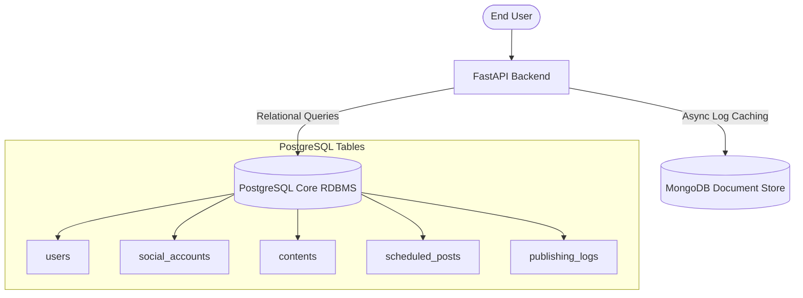
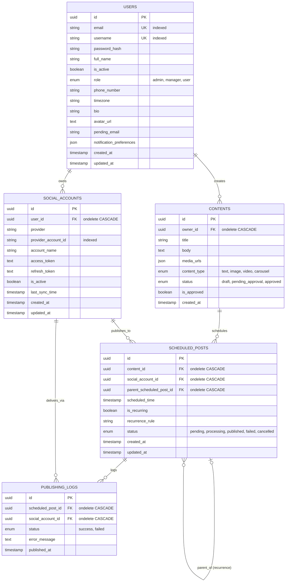

# Database Architecture & Storage Documentation

This document provides a comprehensive overview of the database system designed for the **Social Media Scheduler & Campaign Management Platform (SocialPilot)**. It serves as a developer-facing technical spec and reference guide.

---

## 🏛️ Storage Stack Strategy

The platform employs a **dual-database strategy** optimized for transactional reliability, scheduling orchestration, and high-performance analytical logging.



### 1. PostgreSQL (Core RDBMS)
* **Purpose:** Handles transactional business entities requiring strict referential integrity, foreign key cascading, and database-level unique constraints.
* **Driver / ORM:** Python **SQLAlchemy 2.0** declarations using Postgres-specific types (e.g. UUID, JSON, DateTime with timezone).
* **Migrations:** Controlled and managed chronologically using **Alembic**.

### 2. MongoDB (Document Storage Layer)
* **Purpose:** Configured to process unstructured payloads, social channel metadata payloads, and telemetry caching.
* **Driver:** Asynchronous **Motor** client (`motor.motor_asyncio`) for non-blocking Event Loop integrations.
* **Indexes:** Optimized with user-specific and provider-specific compound indexes for fast lookups.

### 3. Redis (Operational Cache)
* **Purpose:** Provides a production-ready cache and coordination store for future rate limiting, background jobs, and short-lived application state.
* **Deployment:** Redis 7 with AOF persistence, password authentication, health checks, and a persistent Docker volume.
* **Connection:** Configured through `REDIS_URL` with bounded socket timeouts and periodic health checks.

## Production Operations

PostgreSQL uses a pre-pingged connection pool with configurable pool size, overflow, recycling, and connection timeout values. MongoDB uses bounded async pools, retryable writes, and explicit connection timeouts. Both services and Redis are health-gated before the backend starts.

Run `python -m alembic -c ../database/migrations/alembic.ini upgrade head` to apply the composite indexes in migration `b7c8d9e0f1a2`. The indexes cover owner feed ordering, pending schedule lookup, campaign ownership/status, and campaign/account time-series reads.

Use `database/backup.ps1` to create a timestamped PostgreSQL custom-format dump and compressed MongoDB archive. Use `database/restore-test.ps1` with an isolated PostgreSQL database and MongoDB URI to verify recovery without modifying production data. The API health endpoint checks all three services; backend tests and PostgreSQL `EXPLAIN (ANALYZE, BUFFERS)` checks provide the application stability and query-plan verification steps.

---

## 📊 Entity Relationship (ER) Diagram

Below is the relational schema showing the database tables, field types, constraints, and cardinalities.



---

## 🗄️ Relational Schema Data Dictionary

Detailed layout of tables defined in [models.py](file:///c:/Users/Lenovo/Social-Media-Scheduler-Campaign-Management-Platform_July-26_Team-A/database/postgresql/models.py).

### 1. `users` Table
Stores primary user identity, login credentials, authentication states, system roles, contact details, and user-level preferences.

| Column | Type | Nullable | Default | Constraints & Description |
| :--- | :--- | :--- | :--- | :--- |
| `id` | `UUID` | No | `uuid.uuid4` | **Primary Key**. |
| `email` | `VARCHAR(255)` | No | *None* | **Unique Key**, **Indexed**. Primary email for login. |
| `username` | `VARCHAR(100)` | No | *None* | **Unique Key**, **Indexed**. User display handle. |
| `full_name` | `VARCHAR(255)` | Yes | *None* | Profile name of the user. |
| `password_hash` | `VARCHAR(255)` | No | *None* | Hashed authentication password. |
| `is_active` | `BOOLEAN` | No | `True` | Flags if account has access to the application. |
| `role` | `user_role` (Enum) | No | `user` | Level of permissions: `admin`, `manager`, or `user`. |
| `phone_number` | `VARCHAR(50)` | Yes | *None* | Optional phone contact number. |
| `timezone` | `VARCHAR(100)` | No | `UTC` | Target timezone for scheduled marketing tasks. |
| `bio` | `VARCHAR(160)` | Yes | *None* | Short biography snippet. |
| `avatar_url` | `TEXT` | Yes | *None* | Hosted image link for avatar. |
| `pending_email` | `VARCHAR(255)` | Yes | *None* | Temporary storage for newly changed email verification. |
| `notification_preferences` | `JSON` | Yes | *None* | Custom alerts rules mapping (e.g. system email flags). |
| `created_at` | `TIMESTAMP WITH TZ` | No | `func.now()` | Creation timestamp. |
| `updated_at` | `TIMESTAMP WITH TZ` | No | `func.now()` | Auto-updated on record modifications. |

---

### 2. `social_accounts` Table
Maintains external social channel credentials (e.g. Facebook, Twitter, LinkedIn) and token state linkages to user owners.

| Column | Type | Nullable | Default | Constraints & Description |
| :--- | :--- | :--- | :--- | :--- |
| `id` | `UUID` | No | `uuid.uuid4` | **Primary Key**. |
| `user_id` | `UUID` | No | *None* | **Foreign Key** → `users.id` (`ondelete="CASCADE"`). **Indexed**. |
| `provider` | `VARCHAR(50)` | No | *None* | Name of provider channel (e.g. `facebook`, `linkedin`). |
| `provider_account_id` | `VARCHAR(255)` | No | *None* | Unique account identification returned by provider API. **Indexed**. |
| `account_name` | `VARCHAR(255)` | Yes | *None* | Display name of the social account channel. |
| `access_token` | `TEXT` | Yes | *None* | Authorization API token for publishing operations. |
| `refresh_token` | `TEXT` | Yes | *None* | Token used to fetch updated access tokens. |
| `is_active` | `BOOLEAN` | No | `True` | Toggle state for credentials verification. |
| `last_sync_time` | `TIMESTAMP WITH TZ` | Yes | *None* | Timestamp of last channel data synchronization. |
| `created_at` | `TIMESTAMP WITH TZ` | No | `func.now()` | Record creation. |
| `updated_at` | `TIMESTAMP WITH TZ` | No | `func.now()` | Auto-updated. |

* **Additional Constraints:**
  - Unique Constraint: `uq_social_account_provider` enforcing uniqueness on compound keys `(user_id, provider, provider_account_id)`.

---

### 3. `contents` Table
Acts as a marketing campaign content repository storing post texts, attached media files, and approval status flows.

| Column | Type | Nullable | Default | Constraints & Description |
| :--- | :--- | :--- | :--- | :--- |
| `id` | `UUID` | No | `uuid.uuid4` | **Primary Key**. |
| `owner_id` | `UUID` | No | *None* | **Foreign Key** → `users.id` (`ondelete="CASCADE"`). |
| `title` | `VARCHAR(255)` | No | *None* | Internal campaign title. |
| `body` | `TEXT` | Yes | *None* | Content text caption/body. |
| `media_urls` | `JSON` | Yes | *None* | Collection of image/video attachments. |
| `content_type` | `content_type` (Enum) | No | `text` | Formats: `text`, `image`, `video`, `carousel`. |
| `status` | `content_status` (Enum) | No | `draft` | Approval states: `draft`, `pending_approval`, `approved`. |
| `is_approved` | `BOOLEAN` | No | `False` | Fast-path approval indicator. |
| `created_at` | `TIMESTAMP WITH TZ` | No | `func.now()` | Timestamp of draft generation. |

---

### 4. `scheduled_posts` Table
Orchestration queue tracking scheduled times, recurrence configurations, and status indicators of upcoming deliveries.

| Column | Type | Nullable | Default | Constraints & Description |
| :--- | :--- | :--- | :--- | :--- |
| `id` | `UUID` | No | `uuid.uuid4` | **Primary Key**. |
| `content_id` | `UUID` | No | *None* | **Foreign Key** → `contents.id` (`ondelete="CASCADE"`). **Indexed**. |
| `social_account_id` | `UUID` | No | *None* | **Foreign Key** → `social_accounts.id` (`ondelete="CASCADE"`). **Indexed**. |
| `parent_scheduled_post_id` | `UUID` | Yes | *None* | **Foreign Key** → `scheduled_posts.id` (`ondelete="CASCADE"`). **Indexed**. Links recurring executions. |
| `scheduled_time` | `TIMESTAMP WITH TZ` | No | *None* | Executing date and time target. |
| `is_recurring` | `BOOLEAN` | No | `False` | Flag indicating if this schedule re-fires. |
| `recurrence_rule` | `VARCHAR(50)` | Yes | *None* | RRULE format config for recurrence schedule timings. |
| `status` | `scheduled_post_status` (Enum) | No | `pending` | Enum state: `pending`, `processing`, `published`, `failed`, `cancelled`. |
| `created_at` | `TIMESTAMP WITH TZ` | No | `func.now()` | Schedule booking creation timestamp. |
| `updated_at` | `TIMESTAMP WITH TZ` | No | `func.now()` | Date of last transition update. |

---

### 5. `publishing_logs` Table
Maintains transaction histories of past attempts, recording execution outputs and API error responses.

| Column | Type | Nullable | Default | Constraints & Description |
| :--- | :--- | :--- | :--- | :--- |
| `id` | `UUID` | No | `uuid.uuid4` | **Primary Key**. |
| `scheduled_post_id` | `UUID` | No | *None* | **Foreign Key** → `scheduled_posts.id` (`ondelete="CASCADE"`). **Indexed**. |
| `social_account_id` | `UUID` | No | *None* | **Foreign Key** → `social_accounts.id` (`ondelete="CASCADE"`). **Indexed**. |
| `status` | `publishing_status` (Enum) | No | *None* | State: `success`, `failed`. |
| `error_message` | `TEXT` | Yes | *None* | Captured string of API exceptions on distribution failures. |
| `published_at` | `TIMESTAMP WITH TZ` | No | `func.now()` | Execution completion time. |

---

## 🕒 Schema Migration History (Alembic)

Database versions are chronologically version-controlled using Alembic under [database/migrations/versions](file:///c:/Users/Lenovo/Social-Media-Scheduler-Campaign-Management-Platform_July-26_Team-A/database/migrations/versions).

```mermaid
chronology
    2026-07-26 : 4d6f4a11d0d6 (Initial schema)
    2026-07-30 : eedfaa81af68 (Content and roles)
    2026-07-30 : ec17ec4e994d (Profile fields)
    2026-08-01 : c77ca9fc0d75 (Scheduled posts & logs)
```

1. **`4d6f4a11d0d6_initial_user_and_social_schema.py`**
   * Generated initial structural tables for `users` and `social_accounts`.
   * Enforced unique indexes on credentials lookup.
2. **`eedfaa81af68_add_role_and_content.py`**
   * Configured Postgres Enum types: `user_role`, `content_type`, and `content_status`.
   * Created the transactional `contents` table.
3. **`ec17ec4e994d_add_profile_fields.py`**
   * Appended meta and preference columns (`timezone`, `bio`, `avatar_url`, `notification_preferences`) to the user profiles.
4. **`c77ca9fc0d75_create_scheduled_posts_and_publishing_.py`**
   * Set up scheduling and reporting: `scheduled_posts` and `publishing_logs` tables.

---

## 🚀 Active Module Files

* **Models Definitions:** [models.py](file:///c:/Users/Lenovo/Social-Media-Scheduler-Campaign-Management-Platform_July-26_Team-A/database/postgresql/models.py)
* **PostgreSQL Engine & Session Pool Manager:** [connection.py (PostgreSQL)](file:///c:/Users/Lenovo/Social-Media-Scheduler-Campaign-Management-Platform_July-26_Team-A/database/postgresql/connection.py)
* **MongoDB Motor Async Client Manager:** [connection.py (MongoDB)](file:///c:/Users/Lenovo/Social-Media-Scheduler-Campaign-Management-Platform_July-26_Team-A/database/mongodb/connection.py)
