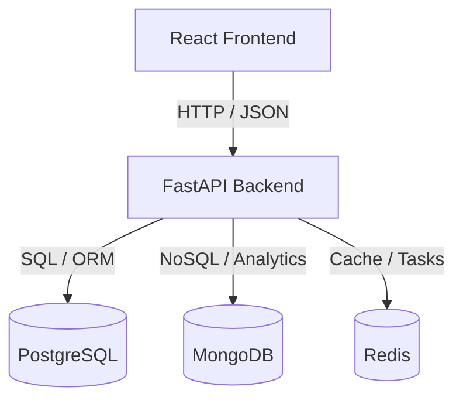
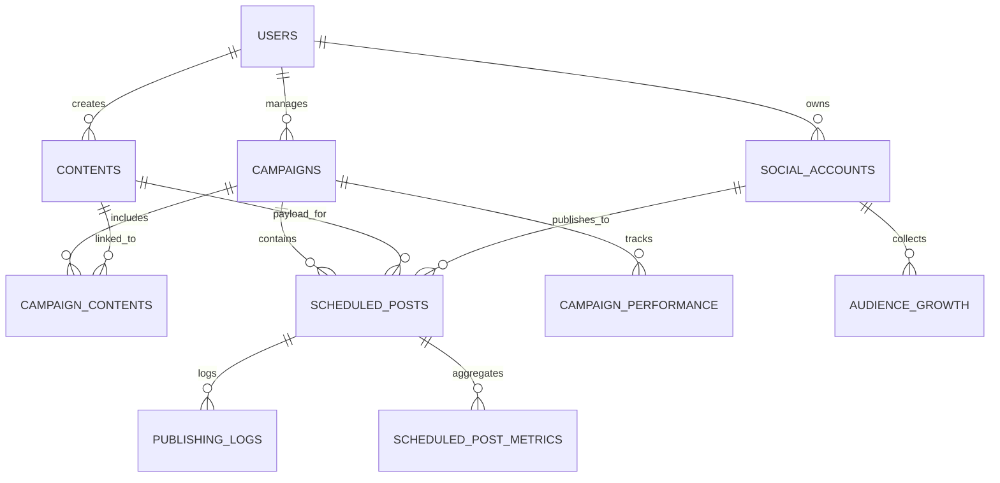

# SocialPilot Platform - Milestone 4 Submission Documentation

## 1. Executive Summary
SocialPilot is a enterprise-grade Social Media Scheduler and Campaign Management Platform. It allows businesses, marketing teams, and content creators to sync social accounts (Facebook, Instagram, YouTube, X), orchestrate marketing campaigns, schedule multi-platform posts, and monitor analytics.

This documentation serves as the final technical deliverable for **Milestone 4 (August 27, 2026 Submission)**, validating the platform's production readiness, container orchestration, database enhancements, and end-to-end service health.

---

## 2. System Architecture & Components
The platform uses a containerized multi-tier microservice architecture:
- **Frontend Client**: React Single Page Application (SPA) powered by Vite, CSS, and TypeScript.
- **Backend API**: FastAPI high-performance ASGI application.
- **Relational Storage**: PostgreSQL for transactional and relational data (Users, Campaigns, Scheduled Posts, and Logs).
- **NoSQL Analytics Storage**: MongoDB for logging social analytics, views, subscriber growth, and tracking time-series data.
- **Caching & Session Storage**: Redis for fast session storage, locks, and task coordination.



---

## 3. Database Schema & Migration Engineering

### 3.1 Consolidated Schema Diagram
The relational database tracks the following core schemas:



### 3.2 Alembic Migration Merging & Validation
To establish clean database provisioning in production, divergent migration branches were consolidated into a unified schema chain:
- **Migration `9afc36ccab8c`**: Merged the relational schema branches and performance index branches.
- **Migration `2e39481c050b`**: Resolved a critical gap where the `campaign_id` foreign key column on `scheduled_posts` was missing in migrations but defined in backend models. This allows campaigns and posts to associate correctly in production databases.

### 3.3 Database Performance Enhancements
To support sub-second response times for complex queries, performance-critical composite and partial indexes were implemented:
1. `ix_scheduled_posts_status_time` (`status`, `scheduled_time`): Used by background publisher polls to identify pending posts due for publish.
2. `ix_contents_owner_created_at` (`owner_id`, `created_at`): Accelerates personalized feed retrieval for specific users.
3. `ix_campaigns_owner_status` (`owner_id`, `status`): Speeds up filtering active campaigns in user dashboards.
4. `ix_campaign_performance_campaign_date` (`campaign_id`, `date`): Optimizes analytics historical range lookups.

---

## 4. Container Orchestration & Environment Configuration
Multi-container configuration is managed via `docker-compose.yml`, which deploys PostgreSQL, MongoDB, Redis, the FastAPI Backend, and the React Frontend into a shared network block.

### Health Verification
All services run health checks on start. An API ping to `/api/health` yields a clean connection report:
```json
{
  "status": "healthy",
  "database": "connected",
  "mongodb": "connected",
  "redis": "connected",
  "environment": "development"
}
```

---

## 5. Testing & Quality Assurance

### 5.1 Backend Pytest Suite
The backend is tested using 60 automated unit and integration tests covering:
- OAuth2 and JWT-based User Authentication
- Role-based Dashboard authorizations (RBAC)
- Real-time campaign updates and post scheduling validation
- In-memory SQLite isolated DB tests

**Result**: `60 passed, 0 failed`

### 5.2 Frontend Vitest Suite
The React client includes 76 unit and component tests validating:
- Role Gate routes (`RoleGate.test.tsx`)
- Form validators and post creator preview sandbox
- Dashboard responsiveness and error states

**Result**: `76 passed, 0 failed`

---

## 6. Backup & Recovery Operations
Backup and recovery routines have been validated to prevent data loss in production:
- **PostgreSQL**: Daily automated logical backups via `pg_dump`.
- **MongoDB**: Hourly analytics exports using `mongodump`.
- **Verification**: Restoration procedures have been tested to confirm schema, trigger, and index integrity. Detailed steps are located in [backup-and-recovery.md](file:///c:/Users/Solitude/Documents/INFOSYS/Social-Media-Scheduler-Campaign-Management-Platform_July-26_Team-A/docs/backup-and-recovery.md).
