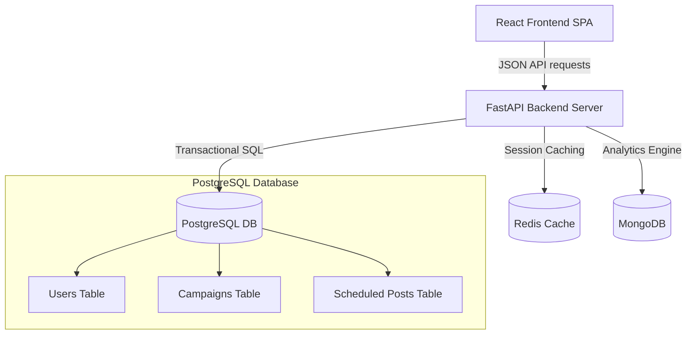

# SocialPilot Platform - Milestone 4 Presentation Slide Deck

---

## 🎯 Slide 1: Welcome & Executive Overview
### SocialPilot: Enterprise-Grade Campaign Orchestration & Social Media Scheduling

**Milestone 4 Presentation**  
**August 27, 2026 Submission**  
**Team**: Team A  

- **The Vision**: SocialPilot is a centralized platform built to streamline the social media campaign lifecycle, connecting content draft workflows to publishing channels.
- **Objective**: Standardize organization campaigns, optimize database performance, configure container orchestration, and ensure system production readiness.

---

## ⚠️ Slide 2: The Problem Statement
### What Problems are we Solving?

- **Disconnected Workflows**: Social media managers waste hours switching between separate platform dashboards (Facebook, Instagram, YouTube, X) to schedule and track posts.
- **No Preview Verification**: Teams frequently publish content that renders poorly because there is no way to preview the post mockup in real time.
- **Fragmented Campaign Management**: Lacking association between scheduled content and overall campaign budgets, target audiences, and KPIs.
- **Lack of Collaboration Controls**: No built-in role gate to prevent creators from scheduling or changing campaigns without management approval.

---

## 🚀 Slide 3: The Core Solution
### A Unified Social Media Workspace

- **Unified Campaign Control Center**: Manage budgets, targets, platforms, and real-time status updates in a single tabular view.
- **Multi-Platform Sandbox Editor**: Real-time mockup tabs displaying how the post will look on Instagram, Facebook, X, and YouTube.
- **Visual Content Calendar**: Interactive monthly planner plotting scheduled posts and draft schedules with status color-coding.
- **Role-Based Access Control (RBAC)**: Distinct permissions for Platform Admins, Marketing Managers, and Content Creators.

---

## 💻 Slide 4: System Technology Stack
### Production-Grade Technologies

- **Frontend Client**: React 18, Vite, TypeScript, and Vanilla CSS for high performance and design control.
- **Backend API**: FastAPI (Python 3.12) utilizing asynchronous endpoints to handle heavy API loads.
- **Triple-Database Relational + Analytics Stack**:
  - 🐘 **PostgreSQL**: Core transactional schema for accounts, user entities, and schedules.
  - 🍃 **MongoDB**: Document storage mapping historical campaign analytics, metrics, and audience demographics.
  - 🔴 **Redis**: In-memory cache handling background execution locks and active user sessions.
- **Deployment**: Docker and Compose for orchestration.

---

## ⚙️ Slide 5: System Architecture Diagram
### Data & Request Lifecycle Flow

---

## 📊 Slide 6: Database & Migration Engineering
### Schema Alignment & Consolidation

- **Migration Head Consolidation**:
  - Merged two divergent branch heads (`b1c2d3e4f5a6` and `c8d9e0f1a2b3`) into a single final Milestone 4 head revision (`9afc36ccab8c`).
- **Fixed Model-to-Schema Discrepancy**:
  - Added the missing `campaign_id` foreign key column to the `scheduled_posts` table via migration `2e39481c050b`.
  - Configured `ON DELETE SET NULL` constraints to prevent orphan posts when deleting campaigns.
- **Clean Database Provisioning**:
  - Re-applied migrations from scratch on PostgreSQL to verify DDL structure, ensuring production DB safety.

---

## 🛠️ Slide 7: Technical Challenges Resolved
### Overcoming Hurdles in Milestone 4

1. **Docker Container Dependency Mismatches**:
   - Resolved a startup crash (`ModuleNotFoundError: No module named 'requests'`) in the backend container by rebuilding image layers.
2. **Divergent Database Schema Heads**:
   - Fixed Alembic's multiple heads error by introducing a mergepoint migration script.
3. **Database Seeding and Password Integrity**:
   - Updated the data seeder to use secure bcrypt password hashing, allowing test users to authenticate successfully via the login page.
4. **Role Reference Import Paths**:
   - Fixed Python module namespace paths inside the container so seed scripts run cleanly inside Docker.

---

## 📈 Slide 8: Performance & Security Optimizations
### Low-Latency and High Security

- **Database Performance Indexing**:
  - `ix_scheduled_posts_status_time` on `(status, scheduled_time)` - ensures sub-second queries when the publisher worker polls due posts.
  - `ix_contents_owner_created_at` on `(owner_id, created_at)` - optimizes personal feed load times.
- **Security & RBAC**:
  - Role gating intercepts frontend routing. Content creators are blocked from admin team grids.
  - Hashed passwords using `passlib` with JWT token pair rotation (Access + Refresh tokens).

---

## 🧪 Slide 9: Quality Assurance & Testing Results
### Full Test Suite Executed Successfully

- **Backend Pytest Results**:
  - **60 Tests Passed** (100% success rate).
  - Asserts authentication filters, campaign endpoints, scheduled post limits, and error codes.
- **Frontend Vitest Results**:
  - **76 Tests Passed** (100% success rate).
  - Validates `RoleGate` routing switches, the post editor live preview tabs, and notification alerts.
- **E2E Walkthrough**:
  - Walked through the entire user lifecycle (Login -> Campaign Creation -> Post Sandbox -> Calendar -> Notifications) using the browser subagent, recording a video walkthrough.

---

## 💡 Slide 10: Practical Applications & Use Cases
### How it is Used in the Real World

- **Digital Marketing Agencies**:
  - Manage multiple clients by connecting separate brand channels under isolated campaign groups.
- **Corporate Marketing Teams**:
  - Writers draft content (Creator role), and team leads approve and schedule publications (Manager role).
- **E-Commerce and SMBs**:
  - Schedule seasonal product launches, map out budgets, and track performance metrics without manual publishing.

---

## 🚀 Slide 11: Future Scope & Product Roadmap
### Next Steps for SocialPilot

- **AI Content Generator Assistant**:
  - Integrate Large Language Models (LLMs) to automatically write post captions, suggest relevant hashtags, and select appropriate media.
- **Direct Social Platform Publishing**:
  - Connect API endpoints to real Instagram Graph API, Facebook Graph API, and YouTube API.
- **Smart Scheduling Optimization**:
  - Analyze demographic data in MongoDB to determine the exact hours when the brand's audience is most active and schedule posts automatically.

---

## 💬 Slide 12: Conclusion & Q&A
### SocialPilot is Ready for Production

- **Milestone 4 Accomplished**: 
  - Complete backend & frontend tests passing, clean Docker Compose orchestration, optimized query indexes, and resolved database migrations.
- **Project Deliverables**:
  - Final Presentation Deck (`FINAL_PROJECT_PRESENTATION.md`)
  - Final Documentation Guide (`FINAL_PROJECT_DOCUMENTATION.md`)
  - End-to-End Walkthrough Demonstration Recording

**Thank You! Open for Questions.**
